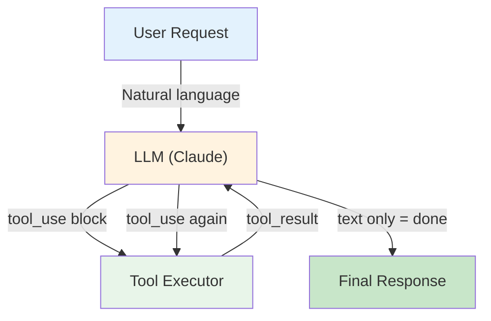
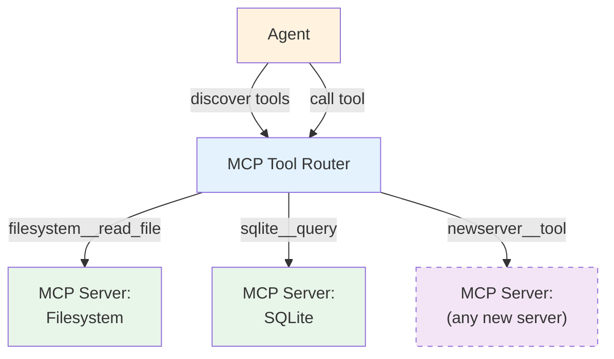
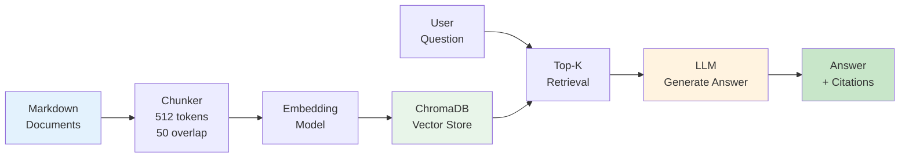
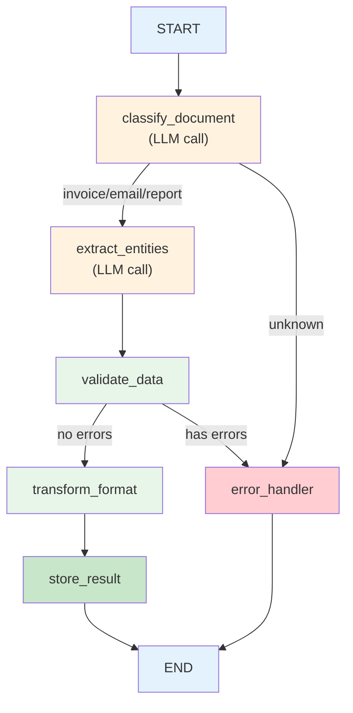
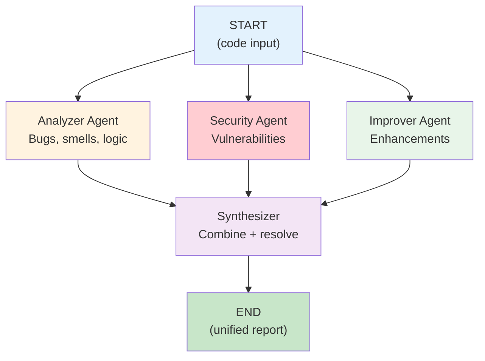
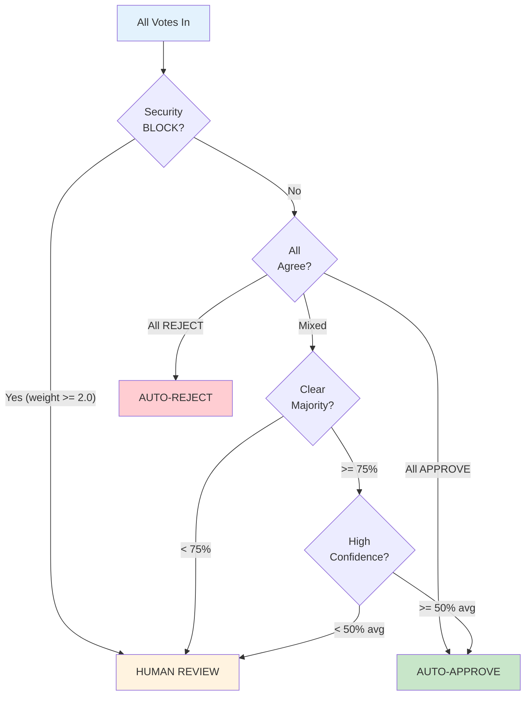
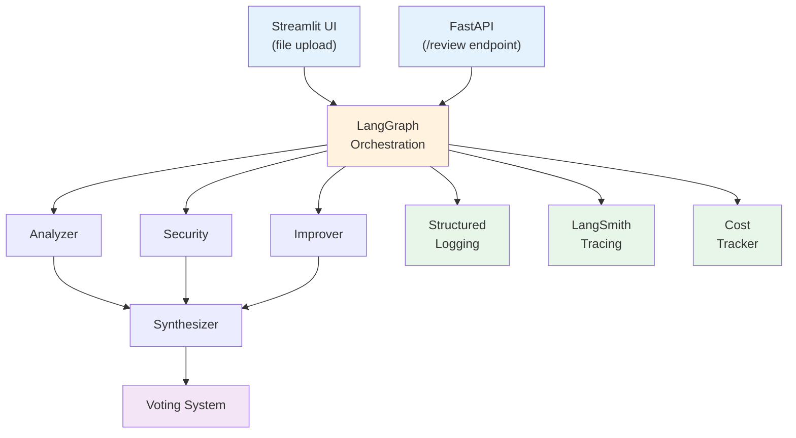
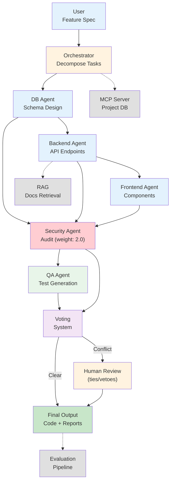

# Architecture Diagrams

All diagrams are in Mermaid format. Render with:
- GitHub markdown (automatic)
- https://mermaid.live
- VS Code Mermaid extension

---

## Curriculum Progression (Weeks 1-12)

```mermaid
graph LR
    W1["Week 1\nAgent Loop\nTool Calling"]
    W2["Week 2\nTool Chaining\nStructured Output"]
    W3["Week 3\nMCP Client\nDynamic Discovery"]
    W4["Week 4\nRAG Pipeline\nVector Search"]
    W5["Week 5\nCustom MCP Server\nSQLite"]
    W6["Week 6\nLangGraph\nState Graphs"]
    W7["Week 7\nMulti-Agent\nParallel Execution"]
    W8["Week 8\nVoting\nConflict Resolution"]
    W9["Week 9\nEvaluation\nObservability"]
    W10["Week 10\nDeploy\nStreamlit + FastAPI"]
    W11["Week 11\nCapstone\nBuild"]
    W12["Week 12\nCapstone\nPolish"]

    W1 --> W2 --> W3
    W3 --> W4 --> W5 --> W6
    W6 --> W7 --> W8 --> W9
    W9 --> W10 --> W11 --> W12

    style W1 fill:#e3f2fd
    style W2 fill:#e3f2fd
    style W3 fill:#e3f2fd
    style W4 fill:#e8f5e9
    style W5 fill:#e8f5e9
    style W6 fill:#e8f5e9
    style W7 fill:#fff3e0
    style W8 fill:#fff3e0
    style W9 fill:#fff3e0
    style W10 fill:#fce4ec
    style W11 fill:#fce4ec
    style W12 fill:#fce4ec
```

---

## Week 1: Agent Loop

---

## Week 3: MCP Architecture

---

## Week 4: RAG Pipeline

---

## Week 6: Document Processing Pipeline

---

## Week 7: Multi-Agent Code Review

---

## Week 8: Voting and Conflict Resolution

---

## Week 10: Production Architecture

---

## Capstone: Full System (Example: Code Generation Pipeline)

