# System Architecture Diagrams

All diagrams below are in Mermaid format. They can be visualized with:
- GitHub markdown (automatic rendering)
- Mermaid live editor: https://mermaid.live
- VS Code Mermaid extension

---

## Diagram 1: TODO Agent Evolution (Weeks 1-9)

Shows how the system evolves from simple to complex.

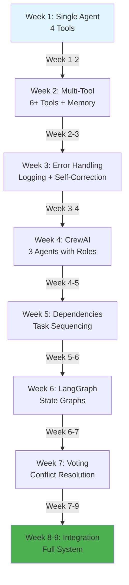

---

## Diagram 2: Agent Architecture Overview

High-level view of how agents interact.

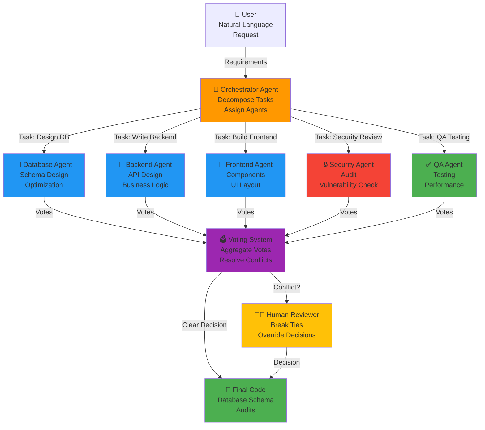

---

## Diagram 3: Task Dependency Graph

Shows how tasks depend on each other.

```mermaid
graph LR
    Start["📥 User Requirement"]
    
    Task1["1️⃣ Parse & Decompose<br/>Orchestrator"]
    Task2["2️⃣ Database Design<br/>Database Agent"]
    Task3["3️⃣ Backend Code<br/>Backend Agent"]
    Task4["4️⃣ Frontend Code<br/>Frontend Agent"]
    Task5["🔒 Security Review<br/>Security Agent"]
    Task6["✅ QA Testing<br/>QA Agent"]
    Task7["🗳️ Vote & Aggregate<br/>Voting System"]
    Task8["👨‍⚖️ Human Review?<br/>Only if Conflict"]
    Task9["📄 Final Output<br/>Code + Audits"]
    
    Start -->|Requires parsing| Task1
    Task1 -->|Broken into| Task2
    Task2 -->|Schema provided to| Task3
    Task3 -->|API contract to| Task4
    
    Task3 -->|Code to review| Task5
    Task4 -->|Code to review| Task5
    Task5 -->|Review result| Task7
    
    Task3 -->|Test code| Task6
    Task4 -->|Test code| Task6
    Task6 -->|Test result| Task7
    
    Task7 -->|Tie or veto?| Task8
    Task7 -->|Clear decision| Task9
    Task8 -->|Human approves| Task9
    
    style Start fill:#e1f5ff
    style Task1 fill:#ff9800
    style Task2 fill:#2196f3
    style Task3 fill:#2196f3
    style Task4 fill:#2196f3
    style Task5 fill:#f44336
    style Task6 fill:#4caf50
    style Task7 fill:#9c27b0
    style Task8 fill:#ffc107
    style Task9 fill:#4caf50
```

---

## Diagram 4: Voting System Flow

How voting works when conflicts arise.

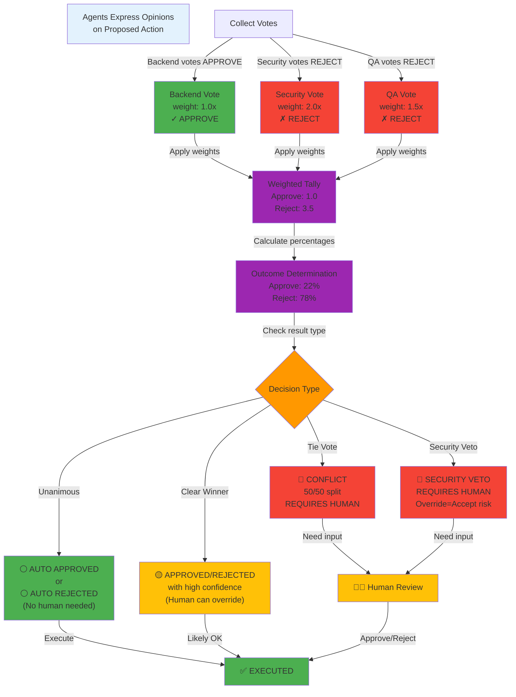

---

## Diagram 5: LangGraph State Flow

How state moves through the graph nodes.

```mermaid
graph LR
    User["👤 User Input"]
    
    User -->|Request: 'Add a task'| State1["📦 State<br/>user_input: 'Add...'<br/>parsed_intent: null"]
    
    State1 -->|→ Parse Node| State2["📦 State<br/>user_input: 'Add...'<br/>parsed_intent: 'add_task'"]
    
    State2 -->|→ Validate Node| State3["📦 State<br/>parsed_intent: 'add_task'<br/>is_valid: true"]
    
    State3 -->|Valid?| Condition{Decision}
    
    Condition -->|Yes| State4["📦 State<br/>is_valid: true<br/>result: 'Task added'"]
    Condition -->|No| State5["📦 State<br/>is_valid: false<br/>error: 'Invalid input'"]
    
    State4 -->|→ Execute Node| Output1["✅ Task Added"]
    State5 -->|→ Error Handler| Output2["❌ Error Handled"]
    
    Output1 -->|Return to User| User2["👤 User"]
    Output2 -->|Return to User| User2
    
    style User fill:#e1f5ff
    style State1 fill:#f3e5f5
    style State2 fill:#f3e5f5
    style State3 fill:#f3e5f5
    style State4 fill:#f3e5f5
    style State5 fill:#f3e5f5
    style Condition fill:#ff9800
    style Output1 fill:#4caf50
    style Output2 fill:#f44336
    style User2 fill:#c8e6c9
```

---

## Diagram 6: Conflict Resolution Decision Tree

What happens when agents disagree.

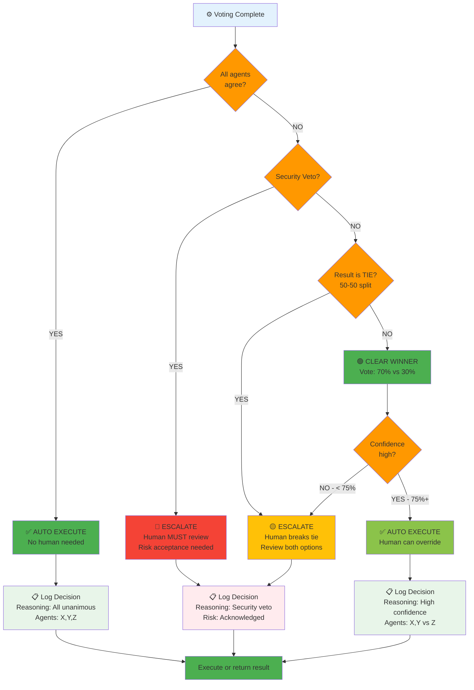

---

## Diagram 7: Agent Communication Pattern

How agents coordinate without direct messaging.

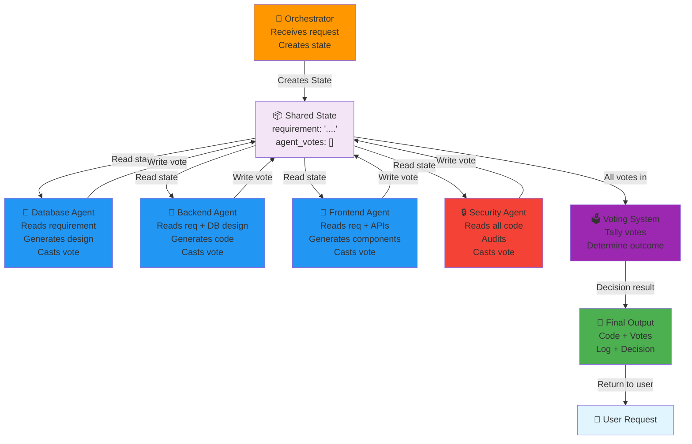

---

## Diagram 8: Week 1-3 Progression

Simple agent evolution.

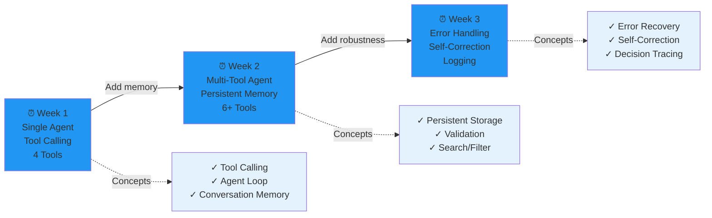

---

## Diagram 9: Week 4-9 Framework Comparison

CrewAI vs LangGraph comparison.

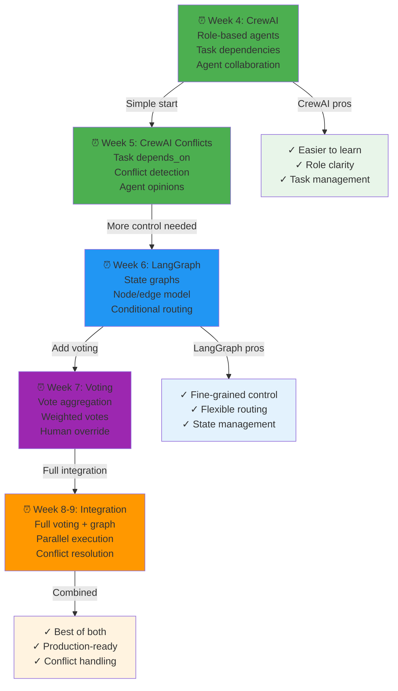

---

## Diagram 10: Complete System End-to-End

Full workflow from requirement to output.

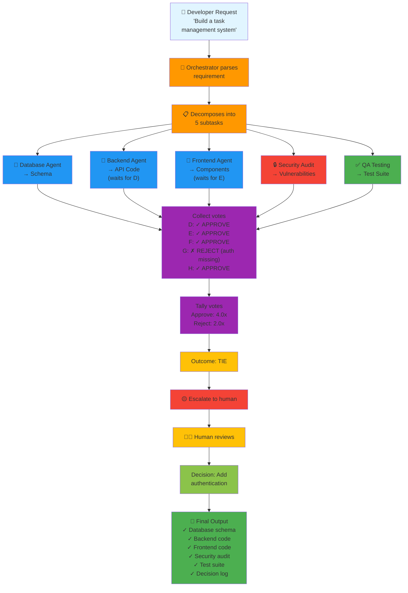

---

## Diagram 11: Human Review Decision Panel

What the human sees when making a decision.

```mermaid
graph TD
    A["🔴 CONFLICT DETECTED"]
    
    B["Show Agent Votes:<br/>━━━━━━━━━━━━━━━━"]
    B1["✓ Database: APPROVE<br/>reasoning: 'Schema normalized'<br/>weight: 1.5x"]
    B2["✗ Backend: REJECT<br/>reasoning: 'Performance issue'<br/>weight: 1.0x"]
    B3["✗ QA: REJECT<br/>reasoning: 'No tests'<br/>weight: 1.5x"]
    
    C["Weighted Tally:<br/>━━━━━━━━━━━━━━━━<br/>Approve: 1.5x (25%)<br/>Reject: 2.5x (75%)"]
    
    D["Recommendation:<br/>REJECT"]
    
    E["Human Options:<br/>━━━━━━━━━━━━━━━━<br/>[A] Accept REJECT<br/>[B] Override to APPROVE<br/>[M] Modify weights<br/>[S] Show details"]
    
    B --> B1
    B --> B2
    B --> B3
    B1 --> C
    B2 --> C
    B3 --> C
    C --> D --> E
    
    E -->|[A]| F["✅ Proceed with<br/>system recommendation"]
    E -->|[B]| G["⚠️ Override system<br/>Accept risk?"]
    E -->|[M]| H["Adjust weights<br/>Re-tally votes"]
    
    F --> I["📋 Log decision<br/>who: human<br/>action: accept<br/>reasoning: logged"]
    G --> I
    H --> I
    
    I --> J["Execute Final<br/>Decision"]
    
    style A fill:#f44336
    style B fill:#fff3e0
    style B1 fill:#e8f5e9
    style B2 fill:#ffebee
    style B3 fill:#ffebee
    style C fill:#e3f2fd
    style D fill:#ffebee
    style E fill:#fff3e0
    style F fill:#e8f5e9
    style G fill:#ffe0b2
    style H fill:#f3e5f5
    style I fill:#e3f2fd
    style J fill:#4caf50
```

---

## Diagram 12: Voting Result Outcomes

All possible voting outcomes and what they mean.

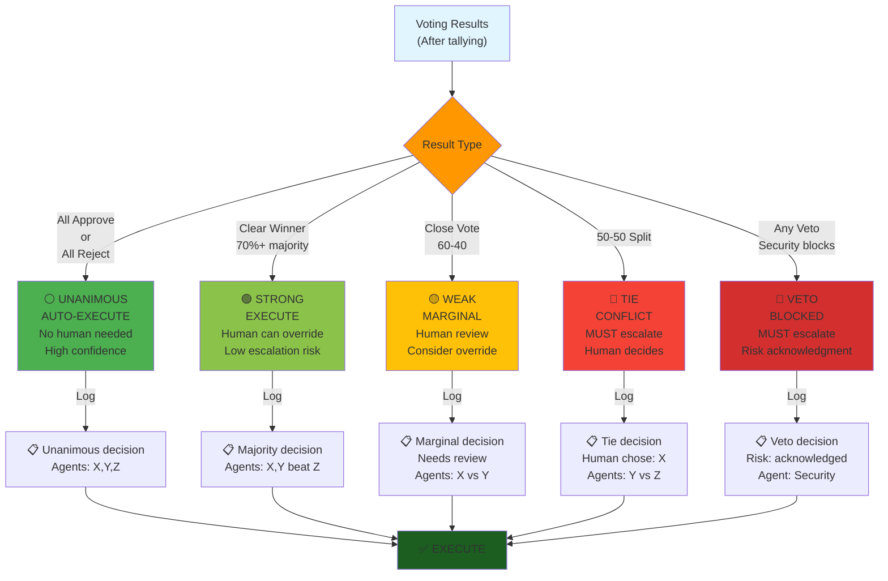

---

## How to Use These Diagrams

### Option 1: View in GitHub
If these files are on GitHub, the diagrams render automatically.

### Option 2: Mermaid Live Editor
1. Visit: https://mermaid.live
2. Copy a diagram (the code block)
3. Paste into the editor
4. Edit/modify as needed

### Option 3: VS Code
1. Install "Mermaid" extension
2. Open `.md` file with diagram
3. Preview renders automatically

### Option 4: Generate Images
```bash
# Using mmdc (Mermaid CLI)
npm install -g @mermaid-js/mermaid-cli

# Convert to PNG
mmdc -i architecture.md -o architecture.png

# Or use online: https://kroki.io (accepts Mermaid)
```

---

## Customizing Diagrams

### Change colors
Find the `style` lines and modify:
```
style NodeName fill:#ff9800  ← Orange
style NodeName fill:#2196f3  ← Blue
style NodeName fill:#4caf50  ← Green
style NodeName fill:#f44336  ← Red
style NodeName fill:#9c27b0  ← Purple
style NodeName fill:#ffc107  ← Yellow
```

### Add/remove nodes
1. Find the node in the diagram code
2. Modify the label or add new nodes
3. Adjust arrows (→) to connect new nodes

### Change flow direction
```
graph LR   ← Left to Right (current)
graph TD   ← Top to Down
graph BT   ← Bottom to Top
graph RL   ← Right to Left
```

---

## References

- **Mermaid Documentation**: https://mermaid.js.org/
- **Flowchart Syntax**: https://mermaid.js.org/syntax/flowchart.html
- **Graph Styling**: https://mermaid.js.org/syntax/flowchart.html#styling-and-classes

---

**Tip:** Copy these diagrams into your documentation, presentations, and study materials. Modify them to match your implementation!
